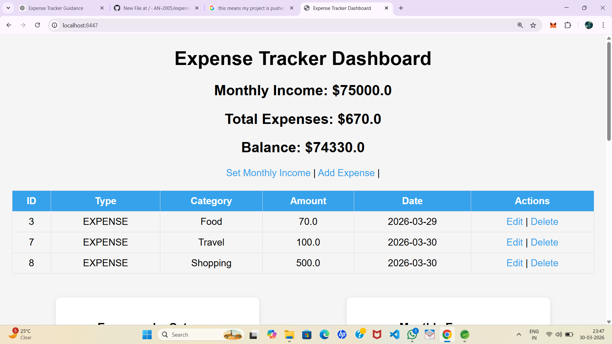
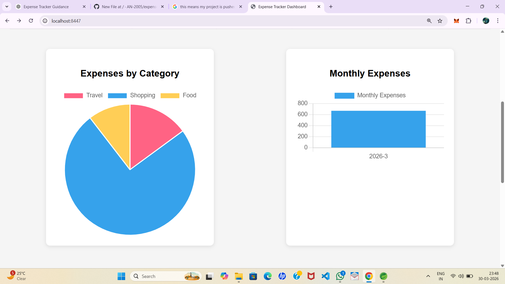
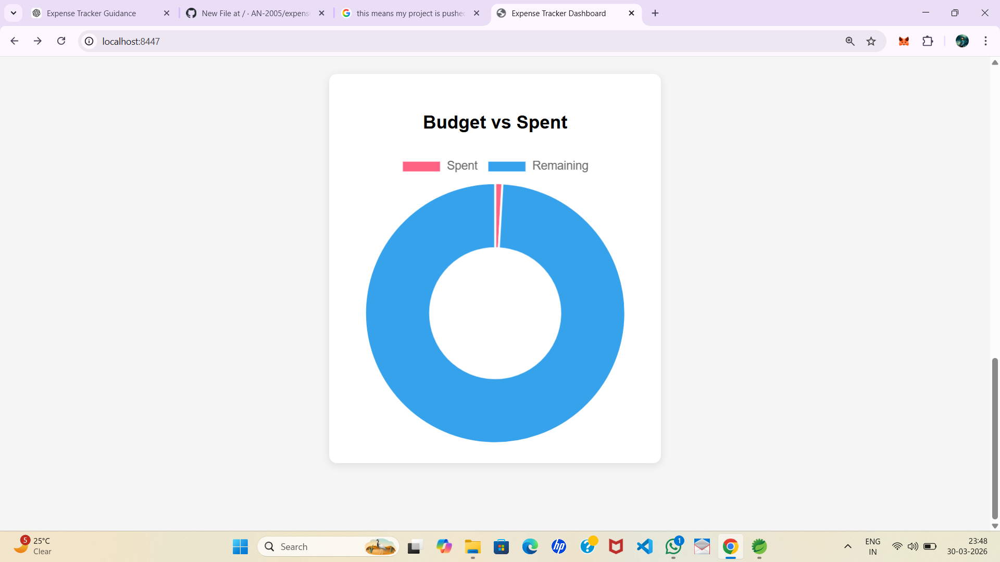
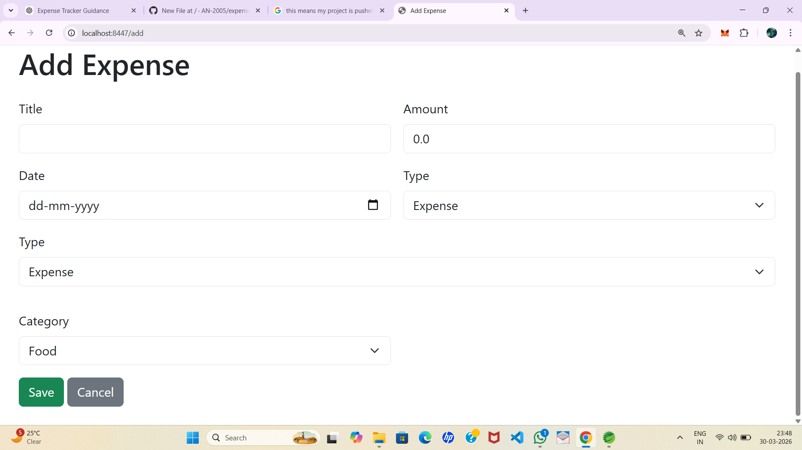

# Expense Tracker 💰

A web-based expense tracking application built using Spring Boot.

## 🚀 Features
- Add, edit, and delete expenses
- Monthly income tracking
- Real-time balance calculation
- Data visualization using charts
- Category-wise expense tracking

## 🛠️ Tech Stack
- Java
- Spring Boot
- Thymeleaf
- MySQL
- Chart.js

## 📊 Dashboard
- Pie Chart for categories
- Bar Chart for expenses
- Budget tracking visualization

## ▶️ How to Run
1. Clone the repo
2. Open in STS
3. Run the application
4. Open: http://localhost:8080

## 📌 Future Improvements
- User login system
- Budget alerts
- Export reports (PDF/Excel)

  ## 📸 Screenshots

### Dashboard

### Charts

### Add Expense

